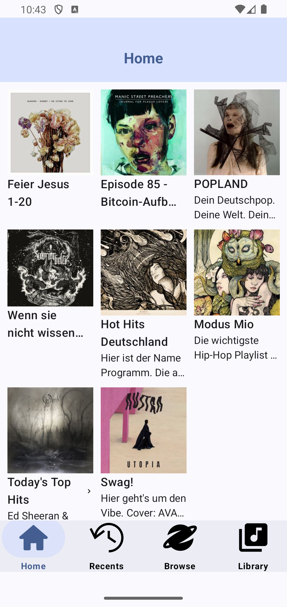

# MediaCenterApp
**MediaCenterApp** is a native Android application which queries an http address with a GET-request that returns a JSON file. The app reads media data from JSON file and shows it in hiarerchical order.

## Features

The root level items (Home, Recents, Browse, Library) are displayed as Tabs with Title and Thumbnail. The child-level items are displayed as List or Grid depending on displayStyle attribute. The history of the tab navigaition is preserved while switching between the tabs. Clicking on the selected tab returns to the root content.

## Architecture

* **MVVM Architecture**: The application follows the MVVM (Model-View-ViewModel) design pattern.
* **User interface**: The UI is build using Jetpack Compose toolkit.
* **Modularisation**: The data source is exposed as an Android library module *mediaLibrary*
* **API Requests**: The *MediaService* interface is defined for sending requests to and receiving responses from the server. It has two implementations: *MediaServiceNetworkImpl*, which handles API calls using Retrofit, and *MediaServiceMockImpl*, which is used for local response testing. The implementation of the interface is injected into the constructor of *MediaDataRepositoryImpl* and can be easily switched.
* **Dependency Injection**: The app utilizes Hilt for DI.
* **SOLID**: Development was strictly based on SOLID principles.
* **Error Handling**: Network error handling is done by implementing Retrofit's *CallAdapter.Factory()* interface and packing the response into *NetworkResponse* sealed class which encapsulates diverse error types. *BasicError* sealed class is responsible for delivering errors to the UI level.

## Testing

Unit Testing: Repository and view model are covered by unit tests using the JUnit4, Mockk and kotlinx-coroutines-test packages.
